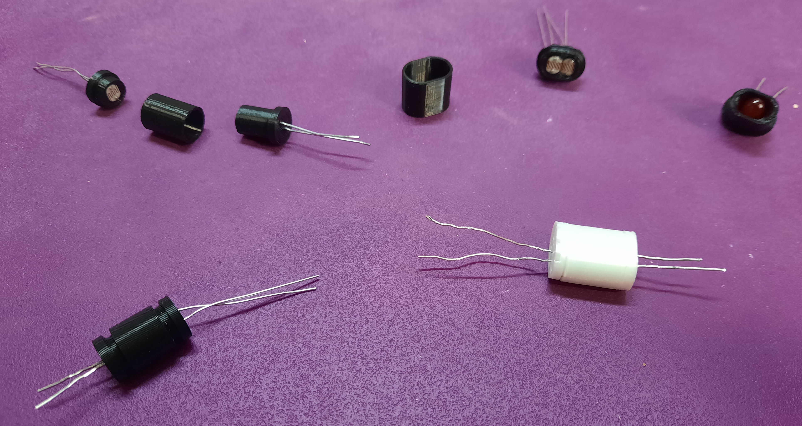

# Vactrol_Enclosure

## What are vactrols ?

Vactrols are optocouplers.

It's a LED (Light Emitting Diode) in front of a LDR (Light Dependent Resistor)

A led can generate light progressively between no light and full light.

An LDR is sensitive to light, and its internal resistance varies when illuminated. The more light it receives, the lower its internal resistance.

When you mold an LED and a LDR in resin or place an LED and an LDR in a 3D printed tube or Heat-shrink tubing, you get a Vactrol.

In other words, you have a resistance that you can vary by turning the LED on more or less.

Ready-made vactrols are available on the market, but sometimes quite expensive ...

But it's also possible to make your own, that's what this directory is for. :)

There are LEDS with flat heads and others with rounded heads.

Vactrols are available with one LED and one LDR or with one LED and 2 LDRs.

## In the 3D files folder you will find 2 differents type of files in 3 differents folder:

.stl : the files for a 3D printer

.fcstd : the file for freecad (3D parametric modeler : https://www.freecad.org/) if you want to modify them

* Single LDR and Single Led (Flat Top) (VTL5C3 for example)

* Single LDR and Single Led (Rounded Head) (VTL5C3 for example)

* Dual LDR and Single led (Rounded Head) (VTL5C3/2 for example)

## In the picture folder you'll find pictures of the 3D printed vactrol enclosure

### Flat head

### Rounded head

### Dual LDR

## For the dual LDR version you need to pair the LDR

Pair mean that you find two of them which have the same behaviour, the same resistance value at the same light.

1 - You need to buy some LDR (Ebay for example can supply many...)

2 - With an Arduino you can have some steps of light, from no light to full light

3 - Circuit

4 - The code is in the folder Appairing the LDR/Compare_LDR_Value/Compare_LDR_Value.ino

5 - You have now to write the value for each LDR in the grid, in the folder Appairing the LDR/LDR_Grid.ods

And choose those with the same behaviour

## In the vactrol datasheet you'll find the datasheet of vactrols from PerkinElmer Optoelectronics
